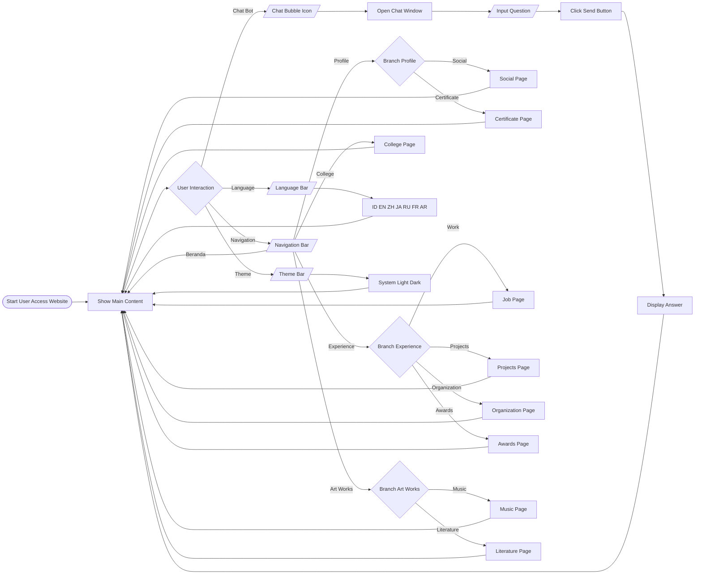

## Opening
This is the source code of Muhammad Faran Aiki's personal website.
His social media:
1. X/Twitter: https://x.com/FaranAiki
2. LinkedIn: https://www.linkedin.com/in/muhammad-faran-aiki-8a6305343/

## The usage of this page
I made this page so that I can share my LIFE. Most people do not care, but I do not care about the uncareness of them.
However, there are some real benefits of creating this page, such as 
* College: this is where I share most of my college assignments so people can learn
* Portfolio: to flex things

## Motivation
One of my friends in the same faculty as mine (School of Electrical Engineering and Informatics - Computation) inspired me to make a personal website. So, I said, why not?

## What I have learned
I learned
1. How to use ReactJS + NextJS + Tailwind 
2. How to use AI at its maximum potential
3. How to do debug properly
4. How to use API, such as YouTube (using Google APIS in backend)
5. How to use Gemini API
6. The real difference between client-side (POST method) and server-side ("use client")
7. Error handling
8. Integrating BABOK and others into this project

## Template 
The first version (scratch and template) is generated using Gemini with the prompt of 
>buatlah website untuk personal dengan menu:
>
>About Me
>Music
>Technology
>College Collections
>Publishing and Literature
>dan dengan satu menu popup yang berjudul "Ask me about anything" dengan textbox dan tombol submit di bawah kiri
>Menggunakan next.js dan tailwind dengan fail yang terpisah untuk github

## Kano Method Analysis (MPAIR)
| Kano Matrix | Must Have | Performance | Attractive | Indifferent | Reverse |
| -------- | -------- | -------- | -------- | -------- | -------- |
| Done | Basic Portfolio | SEO Searching  | Dark Mode, Chat Bot | Perfect Pixel Adjustment |  |
| In Review |  |  | Fixing Chat Bot's Gemini Feature |  |  |
| In Progress |  |  |  | Documentation for Code |  |
| To Do |  | Speed for Components | Animations |  |  |
| Backlog |  |  | Integration with OS for Qemu Project | Epilepsy Prevetion Dark Mode to Light Mode  |  |

## Flowchart Example Modelling for Basic Interaction

## Version 0.1.0 
This is the first version, of course this sucks.

## Version 0.1.1 
This is the second version, there are many revisions.

## Version 0.1.2 
This is the more advanced version compared to the previous.

## Version 0.1.3 
Animations and standardized procedure.

## Post Words
Other than that, the website is made by me for a simple project.
(And AI tools assitant because I can code, so I don't vibe code lol)
(I just hate reading documentation, that's it.)
